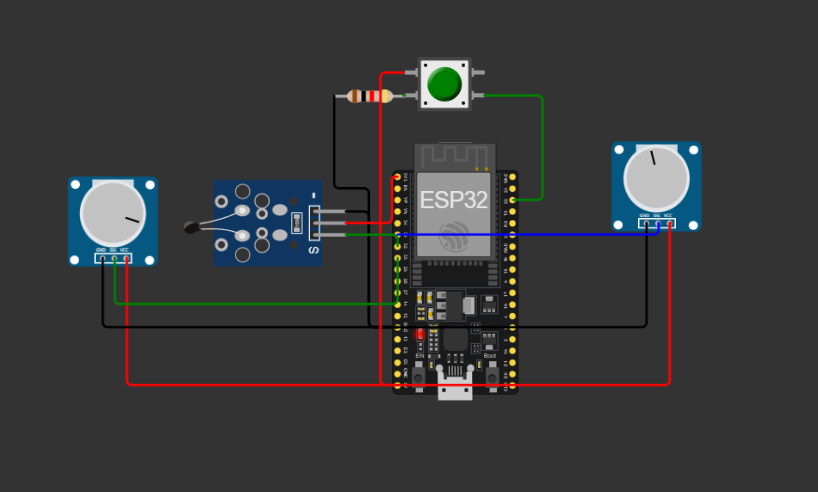

# MedScan

---

## Integrantes

|Nome|RM|
|:-:|:-:|
|Gabriel Machado Belardino|550121|
|Luan Silveira Macéa|98290|
---

## Problema Abordado

O monitoramento de informações corporais é fundamental para a saúde, pois permite que os pacientes e medicos tenham um controle mais preciso sobre o estado de saúde e possam tomar medidas preventivas ou corretivas com base em dados objetivos. O monitoramento regular da pressão arterial, batimentos cardíacos e temperatura pode ajudar a detectar problemas de saúde precocemente e prevenir complicações futuras.

---

### Solução Proposta

O MedScan é um dispositivo arquitetado com uma placa ESP que tem o intuito de captar as informações do usuário e enviar para um sistema de cloud para que possa gerar um registro e um ponto de acesso remoto para atuadores da area da saúde.

[](https://wokwi.com/projects/381773868105702401)
> Como a ferramenta não possui nenhum dispositivo para captura de pressão arterial e/ou frequência cardíaca. Foi utilizado potenciômetros para sua representação.

[Acesse o simulador clicando aqui](https://wokwi.com/projects/381773868105702401)

---

### Configurações necessárias

Apos obter seu dispositivo, será necessário configurar algumas informações em seu código.

Devera baixar as bibliotecas utilizadas no sistema

- [ArduinoJson](https://www.arduino.cc/reference/en/libraries/arduinojson/)
- [EspMQTTClient](https://www.arduino.cc/reference/en/libraries/espmqttclient/)

Apos baixar as bibliotecas, deve se configurar as seguintes informações no código:

1. **Rede Wifi**: Deve se alterar a rede wifi que o dispositivo irá se conectar
2. **Token do dispositivo**: Deve ser colocado o seu token personalizada, para validar a sua entrada de dados no sistema

```c++
    // MQTT Configuracoes
    EspMQTTClient client{
    "Wokwi-GUEST", //SSID(Nome) do WiFi
    "",     // Senha do wifi
    ...
    "TOKEN",         // Token do device
    ...
    };
```

Apos essas configurações deve se verificar se as portas apontadas no sistema condizem com as conexões do dispositivo

```c++
    #define measureBtn 22 // Porta do botão de iniciar medição
    #define heartRateMeter 33 // Porta do medidor de frequência cardíaca
    #define thermometer 32 // Porta do termômetro digital 
    #define pressureGauge 35 // Porta do medidor de pressão arterial
    ...
```

---

### Utilização

Para utilizar o dispositivo, é necessário seguir os seguintes passos:

1. **Alocar os medidores nos devidos locais**:
   1. **Termômetro**: Abaixo do braço
   2. **Medidor de frequência cardíaca**: Posicionar no dedo indicador ou de preferencia do usuário
   3. **Medido de pressão arterial**: Dispor no braço esquerdo acima do cotovelo
2. **Se acomodar**: É preciso que o usuário se apresente sentado e em um lugar controlado para que não tenha variações na medição
3. **Clicar no botão**: Ao clicar no botão, o sistema colhera as informações necessárias e disponibiliza-ra no sistema cloud selecionado

---

### Vantagens

- Este dispositivo pode ser utilizado para vários cenários:
  - Integração com pré triagem de forma remota
  - Acompanhamento médico (pós-operatório, rotina, etc...)
  - Disponibilidade de medição por teleconsulta
